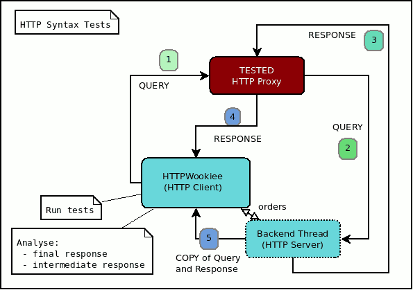
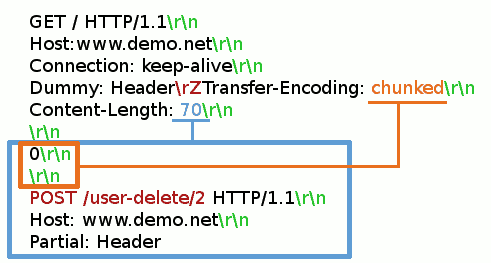
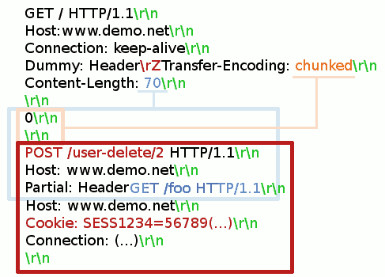
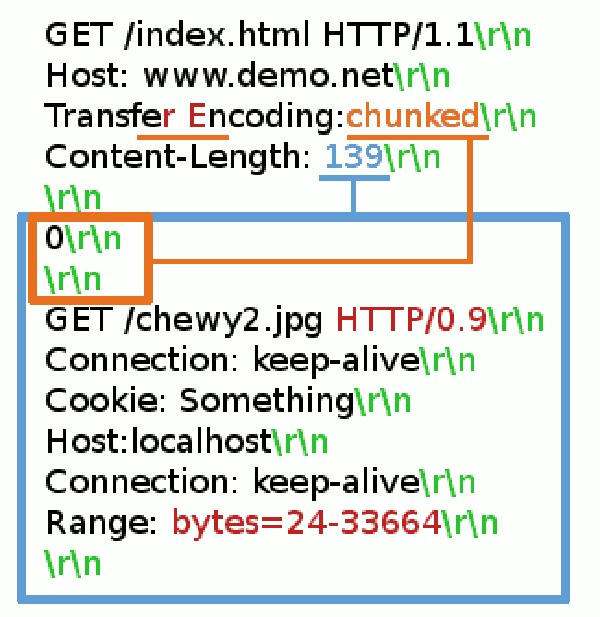

HTTP Wookiee
============

.. image:: https://travis-ci.org/regilero/HTTPWookiee.svg?branch=master
    :target: https://travis-ci.org/regilero/HTTPWookiee

This project is an HTTP 1.1 (rfc 7230) stress tool. The goal is to test web
servers and reverse proxies RFC compliance on various points of the protocol.

The tests are mostly security oriented. And failures may express potential
HTTP Smuggling issues (hence the wookiees).

Schema
=======

This tool can stress directly an HTTP server (steps 1 and 4) **or** can be used
to stress an HTTP Reverse Proxy (where this tool is both the client and the
backend server of this proxy, steps 1 to 5).

Warning
********

**Tests may report false positives and wrong levels of criticity. Hard to catch
all the existing behaviors of all http servers. But some tests are really exact
(like double content-lenght issues or content-length+chunked, read the code for
comments and ask me if you wonder about a specific problem).**

**Never try to run theses tests on a public network or on public websites.
Even testing your own website may be dangerous if an unknown reverse proxy is
present between your website and the stress tool.**

**This project contains several safeguards against this usage, but this is open
source code, and you could certainly remove many safeguards.**

**Any usage in the wild is at your own risk and may lead you to a courthouse.
Not because bad HTTP syntax issues are very dangerous, they are usually not. But
you should really understand how HTTP Smuggling issues may break more than only
your own communication. It is very hard to control the real effects of bad
requests in a complex chain of servers, and you may not be able to control
these effects. This is not a reflected XSS test tool, you play with
low-level protocol issues here, stress your own servers, on your own local network, or
even better on your own computer. Help us fix issues on HTTP agents, and do not
try to be a moron. By the way if you want to contribute, please act with caution
on reporting new tests if the major HTTP players are failing the tests.
There is no hurry, send me an email, store code on private repositories, etc.**

If you really understand theses points, and still really want to use this code,
on your own servers, set a local boolean variable
I_HAVE_READ_AND_UNDERSTAND_THE_FAQ_AND_I_AM_RESPONSIBLE_OF_MY_ACTS in your
application configuration file.

Install
*******

Virtualenv & pip
----------------

You may want to create virtualenvs before installing this script (pip install virtualenv)::

    mkdir ~/venvs/
    cd ~/venvs/
    # for python 2
    virtualenv HTTPWookieep2 -p python2
    # for python3
    virtualenv HTTPWookieep3 -p python3

Then you can activate the environment in python3 (recommended) or python2 mode::

    # python 2
    source ~/venvs/HTTPWookieep2/bin/activate
    # python 3
    source ~/venvs/HTTPWookieep3/bin/activate

Once the virtualenv is activated you need to install the dependencies and the current application.
Once this application will be available on pypi a simple pip install would work::

   # not yet
   #pip install HTTPWookiee

But currently, or if you want to work from the source code (and maybe alter this code), you need to
use the `-e` option of pip, to install dependencies but keep the current code on the right path (and
avoid having a copy in the sites-packages of this virtualenv)::

    cd /path/to/HTTPWookiee
    # this will install all dependencies in your virtualenv
    # the '-e' is a dev-mode option to keep the current
    # directory as the source of the code for HTTPWookiee
    pip install -e .

From Source
------------

If you work from source you can instead go to the source directory and run::

    pip install -e .
    # or
    pip install -e .[dev,test]

You will certainly want to install :code:`tox`. **tox** is used to run the internal
tests (with python2.7, 3.4 and 3.5)::

    tox -r

Settings
---------

Define your personnal settings in a :code:`${HOME}/.httpwookieerc` file.

You can also define a :code:`HTTPWOOKIEE_CONF` env variable with the config file path.

Check class Config in config.py for available settings.

Check the :code:`conf_sample.conf` file for examples and comments on the various
main options.

Here is a very minimal config file::

    [main]
    DEBUG: true
    SERVER_HOST: dummy-host2.example.com
    SERVER_SSL: false
    SERVER_IP: 127.0.0.1
    SERVER_PORT: 8080
    BACKEND_PORT: 8282

Run
****

**If you use virtualenv, do not forget to activate your virtualenv first.**::

    source ~/venvs/HTTPWookieep3/bin/activate

There are two main modes (both running by default):

**1) -** 'client': in this mode, HTTPWookiee is an HTTP client, simply
sending requests against the tested HTTP server::

    HTTPWookiee            Tested HTTP
      Client                Server
        |                      |
        |-----Request--------->|
        |<----Response---------|
        |
    [analysis]

**2) -** 'server': in this mode HTTPWookiee will also run a server, used
as a backend for the tested HTTP Reverse Proxy::

    HTTPWookiee          Tested HTTP         HTTPWookiee
      Client            Reverse Proxy       Server Thread
        |                    |                   |
        |-----Request------->|                   |
        |                    |-----Request------>|
        |                    |<----Response------|
        |<----Response-------|                   |
        |                    |                   |
    [analysis]<- - - - - - - - - - - [ internal transmission ]

Note that the port, IP address and url used in tests can be defined in the
configuration file.
To use HTTPWookiee in this mode you will need to alter the external
Reverse Proxy configuration, to set the right IP and port of the backend,
targeting the IP and port of the server thread in HTTPWookiee.

For each mode, a big variety of tests exist. You can run the tests by
calling the python test file directly::

    ./httpwookiee/client/tests_chunks.py

If you are working from sources (and not from a pip
version of this package, and you did not use pip install -e, as you should)
you may have to alter your PYTHONPATH to run the program
this way (to get the httpwookiee directory managed as a valid module, but
as I said using pip install with `-e` option is better)::

    export PYTHONPATH="."
    ./httpwookiee/client/tests_chunks.py

The easiest way is to used the root `httpwookiee.py` script with the :code:`-m` or
:code:`--match` option::

    ./httpwookiee.py -m client -m chunks

To run the reverse proxy server tests alter the mode::

    ./httpwookiee.py -m server -m chunks

A second level of match (:code:`-M`) can be made on the tests class names (first level was
for the test files names). Use it with :code:`-l` to control the tests list before
running the real thing. And then you have the :code:`-e` and :code:`-E` to add exclusions
in the matching policy.

Another filter exists, matching the test numbers on the final individual tests
where the number is :code:`XXX` in :code:`test_XXX_foo_bar_something`.
Say you identified a test named :code:`test_3010_method_separator` that you
want to run with also the test :code:`test_3011_location_separator`, you can use::

    ./httpwookiee.py -m client -t 3010 -t 3011

But **be carefull**, running only individual tests i hazardous, as currently
there is no way to ensure the *preflight* tests associated with theses tests
would run before, so some tests may lack some informations (like choosing
between GET and POST).

You can control the output with options :code:`-V` and :code:`-n`.

This is an example of output without any of theses options::

    #### letters for each test result (theses are the type of responses
    #### received, not the status of the test)
    444444aaF4444444aFaF4444444444444(...)4444444aa444444aaF4444444444
    #### Then the list of all failed tests details
    #### starting with gravity (great potential of false positive here)
    FAIL gravity: Minor
    #### then name of the test and class of the test
    [test_location_separator_09_and_extra_proto](httpwookiee.staging.client.tests_first_line.TestURLEncodedTabFirstLineSpaceSeparators)
    #### here the traceback
     (...)
    #### and here the main assertion error
    AssertionError: Bad response status "Accepted"

    Stdout:
    #### here details on request sent
    --> =None=
    --> # Connecting to Host: localhost IP: 127.0.0.1 PORT: 19080
    --> # socket ok
    --> # client connection established.
    --> # SENDING (159) =====>
    --> GET /?djjd5a=kjdej7%09HTTP/0.9 HTTP/1.1[CR][LF]
    Foo: Bar[CR][LF]
    User-Agent: script-httpwookiee @ spambot_irc + select union[CR][LF]
    X-Wookiee: 140044686096720[CR][LF]
    Host: localhost[CR][LF]
    [CR][LF]

    #### here details on things received
    --> # ====================>
    --> # ...
    <-- # <==== READING <===========
    <-- # ...
    <-- # read timeout(0.2), nothing more is coming
    <-- # <====FINAL RESPONSE===============
    <-- HTTP/1.1 200 OK
    Request-Number: 111
    Date: Thu, 18 Aug 2016 14:43:39 GMT
    Connection: keep-alive
    Content-Length: 0

    #### followed by internal analysis of the response(s)
    (...)
    ++++++++++++++++++++++++++++++++++++++
    (...) and then the next failing test...

With :code:`-v` or :code:`--verbose` the first line of responses status will send more
informations::

    #### you have the name of the test, the class, then a comment on the test.
    #### at the end of the second line you have the status (same as the small
    #### letter without the Verbose option, but more readable) and between '[]'
    #### the status of the test.
    (...)
    [test_line_suffix_with_double_HTTP11] (httpwookiee.client.tests_first_line.TestTabFirstLineSpaceSeparators)
      Ending first line with two times the protocol................................. ... --err400--    [ok]
    [test_location_separator] (httpwookiee.client.tests_first_line.TestTabFirstLineSpaceSeparators)
      After the query string, valid separator or a forbidden char?.................. ... -accepted-    [ok]
    [test_location_separator_09_and_extra_proto] (httpwookiee.client.tests_first_line.TestTabFirstLineSpaceSeparators)
      After the query, valid separator or a forbidden char? Proto repeated.......... ... -accepted-[Minor]-  [FAIL]
    [test_method_separator] (httpwookiee.client.tests_first_line.TestTabFirstLineSpaceSeparators)
      Test various characters after the METHOD...................................... ... --err400--    [ok]
    [test_line_prefix] (httpwookiee.client.tests_first_line.TestVerticalTabFirstLineSpaceSeparators)
      Some characters before the query.............................................. ... --err400--    [ok]
    [test_line_suffix] (httpwookiee.client.tests_first_line.TestVerticalTabFirstLineSpaceSeparators)
      Let's add some garbage after the protocol..................................... ... --err400--    [ok]
    [test_line_suffix_with_char] (httpwookiee.client.tests_first_line.TestVerticalTabFirstLineSpaceSeparators)
      Let's add some garbage after the protocol. With a letter after................ ... --err400--    [ok]
    [test_line_suffix_with_char_H] (httpwookiee.client.tests_first_line.TestVerticalTabFirstLineSpaceSeparators)
    (...)

with :code:`-n`, or :code:`--no-buffer`, you have the output of the tests directly while they
are running, this is especially useful to check that non-failing tests are
really behaving well.

Do not hesitate to use :code:` 2>&1 | less -R` after the command to get an output
with both stderr and stdout, and to paginate this output (with less).  The :code:`-R`
option for less will manage the colorization of this output.

**Finally** you can always **run a wookiee test file directly**.
Say you want to run the first line tests on an http server (not a proxy),
you need the matching test file in the client subdirectory::

    ./httpwookiee/client/tests_first_line.py 2>&1|less -R

And if you want to test the server (reverse proxy) mode only::

    ./httpwookiee/server/tests_first_line.py 2>&1|less -R

Run tests against embedded docker images
*****************************************

In the :code:`tests` subdirectory you can find some Dockerfiles that can be used
to run httpwookiee against some well known HTTP servers and proxies.

Let's try for example 2 different Nginx versions::

    # let's go to the nginx subdirectory
    cd tests/dockernginx/
    # build the various docker images and start these images
    # each image will contain a reverse proxy listening for
    # an HTTPWookiee backend server on the docker host
    sudo ./build.sh
    # get back to the project main dir
    cd ../..
    # load the right configuration for HttpWookiee
    # especially because each docker reverse proxy has his own listening port
    export HTTPWOOKIEE_CONF=/path/to/HTTPWookiee/tests/dockernginx/latest/config.ini
    # run some tests
    ./httpwookiee.py -m server -m chunks -V 2>&1|less -r
    # load another conf for the next docker
    export HTTPWOOKIEE_CONF=/path/to/HTTPWookiee/tests/dockernginx/stable/config.ini
    # run some tests again, etc
    ./httpwookiee.py -m server -m chunks -V 2>&1|less -r
    # etc.

Internal tests
***************

HTTPWookiee uses test tools to perform tests against HTTP servers. But it also
uses test tools for internal tests. Like testing the internal HTTP parser,
ensuring python 2.7 and python 3.4 support, or checking pep8 syntax.

To run theses tests check the 'From source' part on the 'Install' section.

HTTP Smuggling
**************

The tests performed by this tool *could* be used to perform HTTP smuggling
attacks.
Usually an attack needs to combine several flaws (like, at least, a transmission
issue, where a bad syntax is transmitted by a reverse proxy, and a request or
response splitting issue).

Usage of smuggling issues are:

- **security filters bypass** (we can expand that in a reverse proxy suffering from a splitting issue to hiding queries with bad syntax which are usually not transmitted by this proxy -- encapsulation of smuggling attacks)
- **HTTP credentials hijacking**, using unterminated queries and keep-alive connections
- **cache poisoning**, which can be expanded to tcp connections poisoning
- **DOS**, if you get the wrong content, or if the server crash

Here are some examples of combined flaws.

This is a **splitting** issue, where the hidden Transfer-Encoding header may be read
by a bad parser as a real header (if :code:`\rZ==\r\n` for this parser, like in old
nodejs versions). Transfer-Encoding has priority on Content-Length.

The second query is unterminated and this can be used to capture HTTP credentials
if a reverse proxy is reusing the same connection with another user (here the
:code:`GET /foo` query).

Here is another example of smuggling attack, combining 5 flaws:

- "Transfer Encoding" header transmitted (wrong, space is not a valid character)
- "Transfer Encoding" header magically fixed to "Transfer-Encoding" (wrong, no magic fix should apply), now a **splitting** issue.
- HTTP/0.9 considered as a valid HTTP 0.9 marker (it is not)
- Range header applied on a 0.9 query (no headers should apply), used to extract content from an image (targeting exif headers).
- the last flaw is invisible in this image, it's a tcp poisoning, where the 0.9 response (which is the HTTP response hidden in the image) is stored on the connection and reused for the next user response.

Demonstrations of theses 2 attacks can be seen in this video:

..raw::html

  <iframe width="560" height="315" src="https://www.youtube.com/embed/lY_Mf2Fv7kI" frameborder="0" allowfullscreen></iframe>
